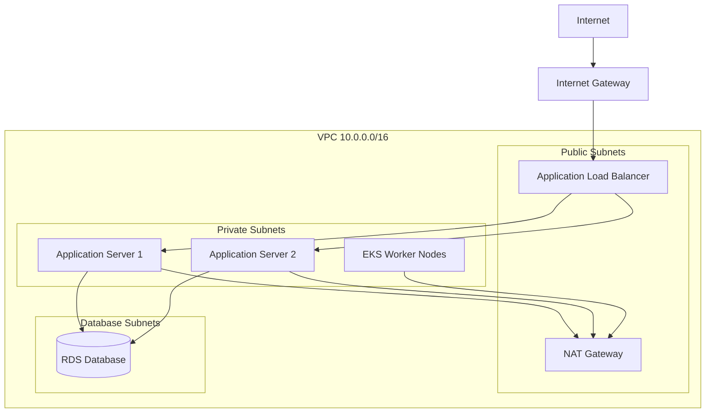
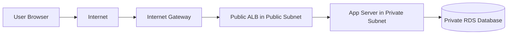
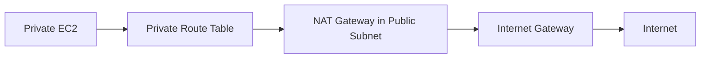
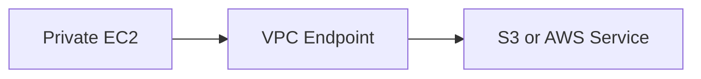
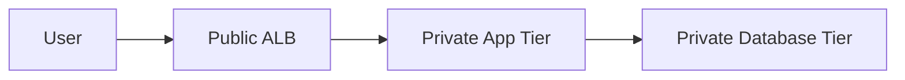
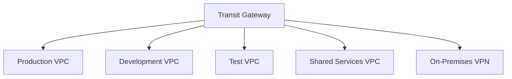
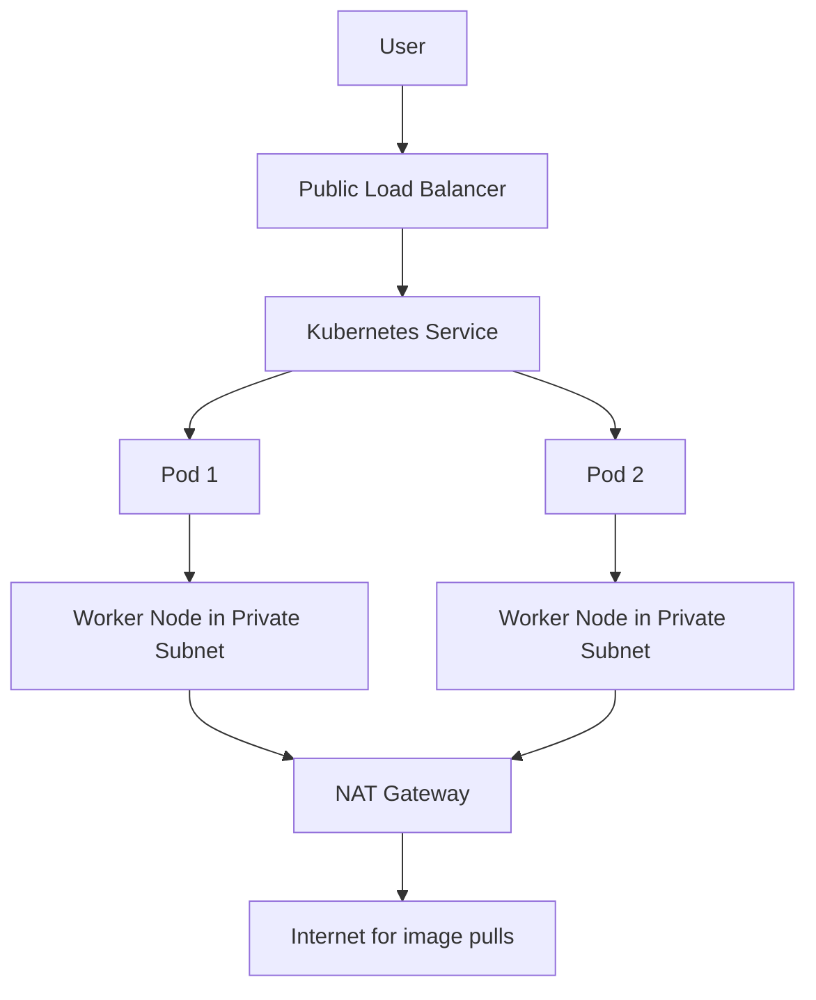
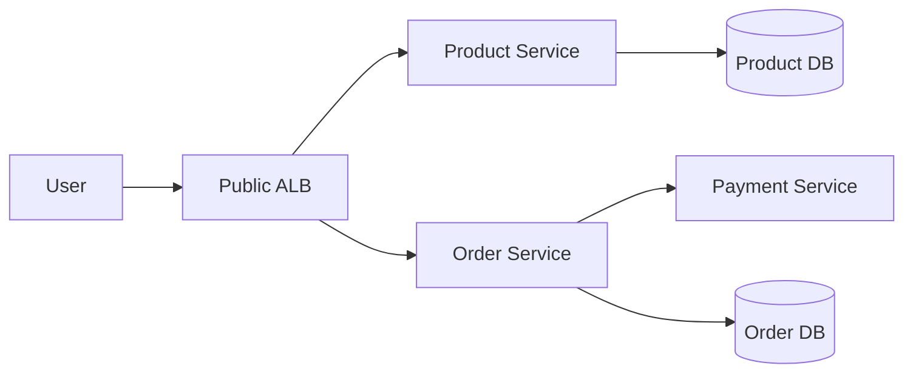
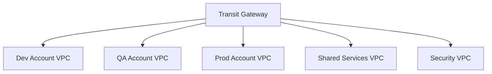

# Amazon VPC Full Guide: Use Cases, Scenarios, and Interview Questions

> **Goal:** Understand what Amazon VPC is, why we use it, where we use it, real-world use cases, scenario-based questions, and interview questions with answers.
>
> **Audience:** Beginner to intermediate DevOps, Cloud, EKS, AWS, and infrastructure learners.
>
> **Format:** Markdown guide with diagrams, examples, scenarios, and interview preparation.

---

## Table of Contents

1. [What is VPC?](#1-what-is-vpc)
2. [Why do we need VPC?](#2-why-do-we-need-vpc)
3. [Where do we use VPC?](#3-where-do-we-use-vpc)
4. [VPC core components](#4-vpc-core-components)
5. [Basic VPC architecture](#5-basic-vpc-architecture)
6. [Public subnet vs private subnet](#6-public-subnet-vs-private-subnet)
7. [Full VPC traffic flow](#7-full-vpc-traffic-flow)
8. [Major VPC use cases](#8-major-vpc-use-cases)
9. [VPC use cases by AWS service](#9-vpc-use-cases-by-aws-service)
10. [Common VPC design patterns](#10-common-vpc-design-patterns)
11. [VPC security use cases](#11-vpc-security-use-cases)
12. [VPC connectivity use cases](#12-vpc-connectivity-use-cases)
13. [VPC in EKS use case](#13-vpc-in-eks-use-case)
14. [Real-time architecture examples](#14-real-time-architecture-examples)
15. [Scenario-based practice questions](#15-scenario-based-practice-questions)
16. [Interview questions with answers](#16-interview-questions-with-answers)
17. [Advanced interview questions](#17-advanced-interview-questions)
18. [Hands-on practice tasks](#18-hands-on-practice-tasks)
19. [Common mistakes](#19-common-mistakes)
20. [Quick revision notes](#20-quick-revision-notes)
21. [References](#21-references)

---

# 1. What is VPC?

**VPC** stands for **Virtual Private Cloud**.

A VPC is your own logically isolated private network inside AWS. You define the IP address range, create subnets, configure routing, control internet access, and apply security rules.

Simple definition:

```text
VPC = Your private network inside AWS
```

Example:

```text
VPC CIDR: 10.0.0.0/16

Inside this VPC:
- EC2 servers
- EKS worker nodes
- RDS databases
- Load balancers
- Lambda functions attached to VPC
- NAT Gateway
- VPC endpoints
- Security groups
```

---

# 2. Why do we need VPC?

We need a VPC because cloud resources need a secure network to run and communicate.

Without VPC, you cannot properly control:

- Which resources are public
- Which resources are private
- Which resources can access the internet
- Which ports are allowed
- Which applications can talk to databases
- How workloads connect to on-premises networks
- How AWS services are accessed privately
- How Kubernetes Pods and nodes communicate in EKS

In simple words:

```text
VPC is the networking foundation of AWS infrastructure.
```

---

# 3. Where do we use VPC?

You use VPC in almost every real AWS architecture.

Common places:

| Area | VPC Usage |
|---|---|
| EC2 | Launch servers in public or private subnets |
| EKS | Run worker nodes and Pods inside subnets |
| ECS | Run containers in private networking |
| RDS | Keep databases private |
| Lambda | Connect Lambda to private databases or internal services |
| Load Balancer | Place public ALB/NLB in public subnets |
| NAT Gateway | Allow private resources to access internet outbound |
| VPC Endpoints | Access AWS services privately |
| VPN | Connect office/on-premises network to AWS |
| Direct Connect | Dedicated private connectivity to AWS |
| Transit Gateway | Connect many VPCs and on-premises networks |
| VPC Peering | Connect two VPCs privately |

---

# 4. VPC Core Components

## 4.1 VPC CIDR Block

CIDR defines the IP range of your VPC.

Example:

```text
10.0.0.0/16
```

This gives a large private IP range that can be divided into smaller subnets.

Common private CIDR ranges:

```text
10.0.0.0/8
172.16.0.0/12
192.168.0.0/16
```

---

## 4.2 Subnets

A subnet is a smaller network inside a VPC.

Example:

```text
VPC: 10.0.0.0/16

Public Subnet A:  10.0.1.0/24
Public Subnet B:  10.0.2.0/24
Private Subnet A: 10.0.11.0/24
Private Subnet B: 10.0.12.0/24
```

Each subnet belongs to one Availability Zone.

---

## 4.3 Route Table

A route table decides where traffic should go.

Example public route table:

```text
Destination     Target
10.0.0.0/16     local
0.0.0.0/0       Internet Gateway
```

Example private route table:

```text
Destination     Target
10.0.0.0/16     local
0.0.0.0/0       NAT Gateway
```

---

## 4.4 Internet Gateway

Internet Gateway, or IGW, connects a VPC to the internet.

Used for:

- Public EC2 instances
- Public load balancers
- Resources that need direct internet access

Public subnet condition:

```text
Subnet route table must have 0.0.0.0/0 -> Internet Gateway
```

---

## 4.5 NAT Gateway

NAT Gateway allows private subnet resources to access the internet outbound, but blocks inbound internet traffic.

Used for:

- Private EC2 downloading patches
- EKS worker nodes pulling images
- Private apps calling external APIs
- Private servers accessing package repositories

Flow:

```text
Private EC2 -> NAT Gateway -> Internet Gateway -> Internet
```

---

## 4.6 Security Group

Security Group is a virtual firewall attached to resources like EC2, RDS, Load Balancer, or ENI.

Important points:

- Stateful
- Controls inbound and outbound traffic
- Works at resource level
- Allows rules only, no explicit deny rules

Example:

```text
Allow HTTP 80 from 0.0.0.0/0
Allow SSH 22 only from office IP
Allow MySQL 3306 only from app server security group
```

---

## 4.7 Network ACL, NACL

NACL is a subnet-level firewall.

Important points:

- Stateless
- Controls inbound and outbound traffic
- Supports allow and deny rules
- Rules are evaluated by number, lowest first

Use NACL for additional subnet-level protection.

---

## 4.8 VPC Endpoint

VPC Endpoint allows private access to AWS services without using public internet.

Types:

1. **Gateway Endpoint**
   - Used for S3 and DynamoDB
   - Added to route table

2. **Interface Endpoint**
   - Powered by AWS PrivateLink
   - Creates ENI with private IP
   - Used for many AWS services like CloudWatch, ECR, Secrets Manager, SSM, STS

Example:

```text
Private EC2 -> VPC Endpoint -> S3
```

No internet gateway or NAT Gateway is required for that service traffic.

---

## 4.9 VPC Peering

VPC Peering connects two VPCs using private IP addresses.

Use cases:

- Connect Dev VPC to Shared Services VPC
- Connect App VPC to Database VPC
- Cross-account VPC connectivity
- Cross-region private connectivity

Important limitation:

```text
VPC Peering is not transitive.
```

If VPC A is peered with VPC B, and VPC B is peered with VPC C, VPC A cannot automatically talk to VPC C.

---

## 4.10 Transit Gateway

Transit Gateway is a central hub for connecting many VPCs, VPNs, and Direct Connect connections.

Use when you have:

- Many VPCs
- Many accounts
- Hybrid cloud
- Centralized routing
- Shared services architecture

Flow:

```text
VPC A -> Transit Gateway -> VPC B
On-premises -> VPN -> Transit Gateway -> VPC
```

---

# 5. Basic VPC Architecture



---

# 6. Public Subnet vs Private Subnet

## Public Subnet

A subnet is public if its route table has a route to an Internet Gateway.

```text
0.0.0.0/0 -> Internet Gateway
```

Usually used for:

- Public Load Balancer
- Bastion host
- NAT Gateway
- Public EC2, only if required

---

## Private Subnet

A subnet is private if it does not have a direct route to an Internet Gateway.

Usually used for:

- Application servers
- EKS worker nodes
- ECS tasks
- Databases
- Internal services

Private subnet can still access internet outbound using NAT Gateway.

```text
0.0.0.0/0 -> NAT Gateway
```

---

# 7. Full VPC Traffic Flow

## 7.1 Public Web Application Flow



---

## 7.2 Private Server Outbound Internet Flow



---

## 7.3 Private AWS Service Access Flow



---

# 8. Major VPC Use Cases

## Use Case 1: Host a Secure Web Application

### Requirement

Host a public web application but keep backend servers and databases private.

### VPC Design

```text
Public Subnet:
- Application Load Balancer
- NAT Gateway

Private Subnet:
- Application servers
- EKS nodes
- ECS tasks

Database Subnet:
- RDS database
```

### Why VPC is used

- Public users access only the Load Balancer
- Application servers are hidden from the internet
- Database is fully private
- Security groups control traffic between layers

### Traffic Flow

```text
User -> ALB -> App Server -> RDS
```

---

## Use Case 2: Keep Database Private

### Requirement

Application should access database, but database should not be publicly available.

### VPC Design

```text
App Server Security Group -> allowed to connect to DB Security Group on 3306
Internet -> not allowed to DB
```

### Why VPC is used

- Database is placed in private subnet
- No public IP for database
- Security group allows database access only from application layer

---

## Use Case 3: Run EKS Cluster Securely

### Requirement

Run Kubernetes workloads securely in AWS.

### VPC Design

```text
Public Subnets:
- Public Load Balancer
- NAT Gateway

Private Subnets:
- EKS worker nodes
- Kubernetes Pods
```

### Why VPC is used

- Pods and nodes need IP addresses
- LoadBalancer Service needs subnets
- Private nodes need outbound internet for image pulls
- Security groups protect cluster traffic

---

## Use Case 4: Private EC2 Needs Internet Access

### Requirement

Private EC2 should download software updates but should not be reachable from internet.

### Solution

Use NAT Gateway.

```text
Private EC2 -> NAT Gateway -> Internet Gateway -> Internet
```

### Why VPC is used

- Private EC2 stays protected
- Internet traffic is outbound only
- No public IP needed for private EC2

---

## Use Case 5: Access S3 Privately

### Requirement

Private EC2 or private app should access S3 without going through internet.

### Solution

Use VPC Gateway Endpoint for S3.

```text
Private EC2 -> S3 Gateway Endpoint -> S3
```

### Benefits

- No NAT Gateway cost for S3 traffic
- No public internet exposure
- Better security
- Endpoint policy can restrict bucket access

---

## Use Case 6: Connect Two VPCs Privately

### Requirement

Application in VPC A needs to access database or service in VPC B.

### Solution

Use VPC Peering if only two or few VPCs are involved.

```text
VPC A -> VPC Peering -> VPC B
```

### Important

- CIDR ranges must not overlap
- Update route tables on both sides
- Update security groups and NACLs

---

## Use Case 7: Connect Many VPCs

### Requirement

Company has many VPCs across accounts and environments.

### Solution

Use Transit Gateway.

```text
Dev VPC -> Transit Gateway
Test VPC -> Transit Gateway
Prod VPC -> Transit Gateway
Shared Services VPC -> Transit Gateway
On-premises VPN -> Transit Gateway
```

### Why Transit Gateway

- Centralized routing
- Easier than many VPC peering connections
- Supports hybrid network connectivity
- Scales better for large organizations

---

## Use Case 8: Hybrid Cloud Connectivity

### Requirement

Connect office data center to AWS private network.

### Options

1. Site-to-Site VPN
2. Direct Connect
3. Transit Gateway with VPN or Direct Connect

### Flow

```text
Office Network -> VPN or Direct Connect -> AWS VPC
```

### Use cases

- Migration from on-premises to AWS
- Private access to cloud applications
- Backup and disaster recovery
- Shared authentication services

---

## Use Case 9: Multi-Tier Application

### Architecture

```text
Tier 1: Public Load Balancer
Tier 2: Private Application Servers
Tier 3: Private Database
```

### VPC Design



### Why VPC is used

- Separation of responsibilities
- Strong security boundary
- Easy scaling
- Real-world production pattern

---

## Use Case 10: Centralized Shared Services VPC

### Requirement

Multiple application VPCs need access to shared services.

Shared services may include:

- Active Directory
- Monitoring tools
- Logging tools
- CI/CD runners
- Internal package repositories
- DNS resolver
- Security appliances

### Solution

```text
App VPCs -> Transit Gateway -> Shared Services VPC
```

---

## Use Case 11: Secure Admin Access

### Requirement

Admin should access private servers securely.

### Options

1. Bastion host in public subnet
2. AWS Systems Manager Session Manager
3. VPN into VPC

Best practice:

```text
Use SSM Session Manager where possible instead of public SSH.
```

---

## Use Case 12: Compliance and Security Isolation

### Requirement

Separate production, development, and payment systems.

### Solution

Use separate VPCs:

```text
Production VPC
Development VPC
PCI/Payment VPC
Shared Services VPC
Security VPC
```

### Why

- Isolation
- Least privilege connectivity
- Easier audit
- Blast radius reduction

---

# 9. VPC Use Cases by AWS Service

| AWS Service | Why VPC is Used |
|---|---|
| EC2 | Launch servers in controlled public/private networks |
| EKS | Provide networking for nodes, Pods, Services, and Load Balancers |
| ECS | Run containers in private subnets |
| RDS | Keep databases private and reachable only by application layer |
| Lambda | Allow Lambda to access private resources like RDS or Redis |
| Elastic Load Balancing | Expose apps publicly or internally through subnets |
| ElastiCache | Keep cache private in application network |
| OpenSearch | Restrict access using VPC-based deployment |
| Redshift | Private data warehouse access |
| S3 | Private access using VPC Gateway Endpoint |
| DynamoDB | Private access using VPC Gateway Endpoint |
| ECR | Private image pull using interface endpoints |
| CloudWatch | Private logs and metrics using interface endpoint |
| Secrets Manager | Private secrets retrieval from private workloads |

---

# 10. Common VPC Design Patterns

## Pattern 1: Simple Public VPC

Used for learning only.

```text
VPC
└── Public Subnet
    └── EC2 with public IP
```

Not recommended for production unless resource must be public.

---

## Pattern 2: Public and Private Subnet VPC

Common production pattern.

```text
VPC
├── Public Subnet
│   ├── ALB
│   └── NAT Gateway
└── Private Subnet
    ├── App Server
    └── Database
```

---

## Pattern 3: Multi-AZ Production VPC

High availability pattern.

```text
VPC
├── Public Subnet AZ-A
├── Public Subnet AZ-B
├── Private App Subnet AZ-A
├── Private App Subnet AZ-B
├── Private DB Subnet AZ-A
└── Private DB Subnet AZ-B
```

---

## Pattern 4: EKS VPC Pattern

```text
VPC
├── Public Subnets
│   └── Load Balancers
└── Private Subnets
    ├── EKS Worker Nodes
    └── Kubernetes Pods
```

---

## Pattern 5: Hub and Spoke VPC Pattern



---

# 11. VPC Security Use Cases

## 11.1 Isolate Environments

Separate workloads by environment:

```text
Dev VPC
QA VPC
Prod VPC
Security VPC
```

This reduces the risk that development workloads can impact production.

---

## 11.2 Protect Databases

Keep database in private subnet and allow only app security group.

```text
DB inbound rule:
Source: App Security Group
Port: 3306 or 5432
```

---

## 11.3 Restrict Admin Access

Avoid opening SSH to the world.

Bad:

```text
SSH 22 from 0.0.0.0/0
```

Better:

```text
SSH 22 from office public IP only
```

Best:

```text
Use AWS Systems Manager Session Manager
```

---

## 11.4 Use VPC Endpoints

Access AWS services privately.

Example:

```text
Private EC2 -> VPC Endpoint -> Secrets Manager
```

Benefits:

- No public internet path
- Better compliance
- Reduced NAT usage
- Endpoint policies for extra control

---

## 11.5 Use NACLs for Subnet-Level Guardrails

Example:

```text
Deny known malicious IP range at subnet level
Allow application ports only
```

---

# 12. VPC Connectivity Use Cases

## 12.1 Internet Access

Used when apps need public access.

```text
Public Subnet -> Internet Gateway
```

---

## 12.2 Outbound Internet for Private Resources

Used when private servers need software updates.

```text
Private Subnet -> NAT Gateway -> Internet Gateway
```

---

## 12.3 Private AWS Service Access

Used when private workloads need AWS services.

```text
Private Subnet -> VPC Endpoint -> AWS Service
```

---

## 12.4 VPC-to-VPC Access

Use VPC Peering for small number of VPCs.

```text
VPC A -> Peering -> VPC B
```

---

## 12.5 Enterprise Multi-VPC Access

Use Transit Gateway.

```text
Many VPCs -> Transit Gateway -> Many VPCs / VPN / Direct Connect
```

---

## 12.6 On-Premises Access

Use VPN or Direct Connect.

```text
On-Premises -> VPN / Direct Connect -> VPC
```

---

# 13. VPC in EKS Use Case

EKS heavily depends on VPC networking.

## Why EKS Needs VPC

EKS needs VPC for:

- Worker nodes
- Pod IPs
- Kubernetes Services
- Load Balancers
- Cluster endpoint access
- Security groups
- Node-to-control-plane communication

---

## EKS VPC Flow



---

## Recommended EKS VPC Layout

```text
VPC: 10.0.0.0/16

Public Subnets:
- 10.0.1.0/24, AZ-A
- 10.0.2.0/24, AZ-B

Private Subnets:
- 10.0.11.0/24, AZ-A
- 10.0.12.0/24, AZ-B
```

Public subnets:

```text
Load Balancers
NAT Gateways
```

Private subnets:

```text
EKS worker nodes
Kubernetes Pods
Application workloads
```

---

# 14. Real-Time Architecture Examples

## Example 1: Company Website

### Requirement

Host company website with backend API and database.

### Architecture

```text
User -> Route 53 -> ALB -> EC2/EKS App -> RDS
```

### VPC Usage

- ALB in public subnet
- App in private subnet
- RDS in database subnet
- NAT Gateway for app outbound internet
- Security groups between layers

---

## Example 2: E-Commerce Application

### Requirement

Run product service, payment service, order service, and database securely.

### Architecture



### VPC Design

- Public subnets for ALB
- Private subnets for microservices
- Private DB subnets for databases
- VPC endpoint for Secrets Manager
- NAT Gateway for payment API outbound calls

---

## Example 3: Banking or Compliance Application

### Requirement

No database should be public. Critical traffic should stay private.

### VPC Design

- Separate VPC for production
- Private subnets only for app and DB
- Public subnet only for controlled ALB
- VPC endpoints for S3, CloudWatch, Secrets Manager
- VPN or Direct Connect for corporate users
- Strict security groups and NACLs

---

## Example 4: Multi-Account Organization

### Requirement

Company has multiple AWS accounts:

- Development
- Testing
- Production
- Shared services
- Security tools

### Architecture



---

# 15. Scenario-Based Practice Questions

## Scenario 1: Public Website with Private Database

### Question

You need to host a website that users can access from the internet. The database must not be publicly accessible. How will you design the VPC?

### Answer

Use public and private subnets:

```text
Public subnet:
- Application Load Balancer

Private subnet:
- Application servers

Database subnet:
- RDS database
```

Traffic:

```text
User -> ALB -> App Server -> RDS
```

Security:

- ALB allows HTTP/HTTPS from internet
- App allows traffic only from ALB security group
- DB allows traffic only from App security group

---

## Scenario 2: Private EC2 Needs Software Updates

### Question

You launched EC2 in private subnet. It cannot access internet to install packages. What will you do?

### Answer

Create NAT Gateway in public subnet and update private route table:

```text
0.0.0.0/0 -> NAT Gateway
```

Flow:

```text
Private EC2 -> NAT Gateway -> Internet Gateway -> Internet
```

---

## Scenario 3: Private EC2 Needs S3 Access Without Internet

### Question

Private EC2 needs to access S3, but your security team does not want traffic over internet or NAT. What is the solution?

### Answer

Create an S3 Gateway VPC Endpoint and associate it with the private route table.

Flow:

```text
Private EC2 -> S3 Gateway Endpoint -> S3
```

---

## Scenario 4: Two VPCs Need Private Communication

### Question

Application in VPC A needs to access database in VPC B. What should you use?

### Answer

Use VPC Peering if it is only a small number of VPCs.

Steps:

1. Ensure CIDR blocks do not overlap
2. Create VPC peering connection
3. Accept peering request
4. Update route tables on both sides
5. Update security groups

---

## Scenario 5: Ten VPCs Need to Communicate

### Question

Your company has 10 VPCs across multiple accounts. You need centralized connectivity. VPC Peering is becoming hard to manage. What should you use?

### Answer

Use AWS Transit Gateway.

Reason:

- Central hub
- Easier routing
- Scales better than many peering connections
- Supports VPN and Direct Connect

---

## Scenario 6: EKS Pods Cannot Pull Images

### Question

EKS worker nodes are in private subnets. Pods cannot pull images from internet/ECR. What could be missing?

### Answer

Possible issues:

1. No NAT Gateway for private subnet outbound internet
2. Private route table missing `0.0.0.0/0 -> NAT Gateway`
3. Missing ECR VPC endpoints if using private-only design
4. Security group or NACL blocking outbound traffic

---

## Scenario 7: LoadBalancer Service Stuck in Pending

### Question

You deployed a Kubernetes `Service` of type `LoadBalancer`, but external IP is pending. What VPC-related things will you check?

### Answer

Check:

- Public subnets exist
- Public subnet has route to Internet Gateway
- Correct subnet tags for Kubernetes
- IAM permissions for load balancer creation
- Security groups and NACLs
- AWS Load Balancer Controller if using Ingress

---

## Scenario 8: RDS Accidentally Public

### Question

Your RDS database is publicly accessible. How will you fix it?

### Answer

Steps:

1. Disable public accessibility on RDS
2. Move RDS to private DB subnet group if required
3. Remove public routes from DB subnet route table
4. Allow DB port only from application security group
5. Verify no `0.0.0.0/0` inbound DB rule exists

---

## Scenario 9: Need Private API Access from Partner VPC

### Question

A partner wants to access your internal service privately without VPC peering and without public internet. What can you use?

### Answer

Use AWS PrivateLink.

Provider side:

- Internal service behind Network Load Balancer
- Endpoint service created

Consumer side:

- Interface VPC Endpoint created
- Connects privately to your service

---

## Scenario 10: Reduce NAT Gateway Cost

### Question

Private EC2 instances heavily access S3 and DynamoDB through NAT Gateway. NAT cost is high. What can you do?

### Answer

Create Gateway VPC Endpoints for S3 and DynamoDB.

Benefits:

- Traffic goes privately to AWS services
- Reduces NAT Gateway data processing cost
- Improves security

---

# 16. Interview Questions with Answers

## Q1. What is a VPC?

A VPC is a logically isolated virtual network inside AWS where you can launch resources and control IP ranges, subnets, route tables, gateways, and security.

---

## Q2. Why do we use VPC?

We use VPC to securely isolate and control AWS resources, define networking, manage public/private access, and connect applications to internet, AWS services, other VPCs, or on-premises networks.

---

## Q3. What is a subnet?

A subnet is a smaller IP range inside a VPC. Each subnet is created in one Availability Zone.

---

## Q4. What is the difference between public and private subnet?

A public subnet has a route to an Internet Gateway.

```text
0.0.0.0/0 -> Internet Gateway
```

A private subnet does not have a direct route to an Internet Gateway. It may use NAT Gateway for outbound internet.

```text
0.0.0.0/0 -> NAT Gateway
```

---

## Q5. What is an Internet Gateway?

An Internet Gateway is a VPC component that allows communication between resources in public subnets and the internet.

---

## Q6. What is NAT Gateway?

NAT Gateway allows resources in private subnets to initiate outbound communication to the internet, but prevents unsolicited inbound internet traffic.

---

## Q7. What is a route table?

A route table contains routing rules that decide where network traffic should go.

Example:

```text
10.0.0.0/16 -> local
0.0.0.0/0 -> Internet Gateway
```

---

## Q8. What is a Security Group?

Security Group is a stateful virtual firewall attached to resources like EC2, RDS, ALB, or ENI. It controls inbound and outbound traffic.

---

## Q9. What is NACL?

Network ACL is a subnet-level firewall. It is stateless and supports both allow and deny rules.

---

## Q10. Difference between Security Group and NACL?

| Security Group | NACL |
|---|---|
| Resource level | Subnet level |
| Stateful | Stateless |
| Allows rules only | Allows and denies rules |
| Evaluates all rules | Evaluates rules by number |
| Applied to ENI/resource | Applied to subnet |

---

## Q11. What is VPC Peering?

VPC Peering connects two VPCs privately using private IP addresses. It can work within same account, cross-account, same region, or cross-region.

---

## Q12. Is VPC Peering transitive?

No. VPC Peering is not transitive.

Example:

```text
VPC A peered with VPC B
VPC B peered with VPC C
VPC A cannot automatically talk to VPC C
```

---

## Q13. What is Transit Gateway?

Transit Gateway is a central hub used to connect multiple VPCs, VPNs, and Direct Connect connections with centralized routing.

---

## Q14. When do you use Transit Gateway instead of VPC Peering?

Use Transit Gateway when you have many VPCs, multiple accounts, hybrid connectivity, or need centralized routing.

Use VPC Peering for simple one-to-one or few VPC connections.

---

## Q15. What is VPC Endpoint?

VPC Endpoint allows private connectivity from your VPC to AWS services without internet gateway, NAT Gateway, VPN, or public IP.

---

## Q16. What are the types of VPC Endpoints?

1. Gateway Endpoint
   - S3
   - DynamoDB

2. Interface Endpoint
   - Many AWS services
   - Powered by AWS PrivateLink
   - Uses ENI with private IP

---

## Q17. Why do we need NAT Gateway if we have Internet Gateway?

Internet Gateway is for public subnet direct internet access.

NAT Gateway is for private subnet outbound-only internet access.

Private resources use NAT Gateway to access the internet without being publicly reachable.

---

## Q18. Can EC2 in private subnet access internet?

Yes, if private route table has route to NAT Gateway.

```text
Private EC2 -> NAT Gateway -> Internet Gateway -> Internet
```

---

## Q19. Can internet users directly access EC2 in private subnet?

No, not directly. Private subnet does not expose EC2 directly to internet.

Access can happen through:

- Load Balancer
- Bastion host
- VPN
- SSM Session Manager

---

## Q20. What is CIDR?

CIDR defines IP address range.

Example:

```text
10.0.0.0/16
```

This range is used to assign private IP addresses inside the VPC.

---

# 17. Advanced Interview Questions

## Q21. How do you design a highly available VPC?

Use multiple Availability Zones:

```text
2 or 3 public subnets across AZs
2 or 3 private app subnets across AZs
2 or 3 database subnets across AZs
NAT Gateway per AZ for high availability
Load Balancer across public subnets
```

---

## Q22. Why should NAT Gateway be deployed per AZ?

For high availability and to avoid cross-AZ dependency. If one AZ fails and all private subnet traffic depends on one NAT Gateway in that AZ, outbound internet may fail for other AZ workloads.

---

## Q23. How do you reduce NAT Gateway cost?

Options:

- Use S3 Gateway Endpoint
- Use DynamoDB Gateway Endpoint
- Use Interface Endpoints for AWS services
- Avoid unnecessary internet traffic
- Place NAT Gateways only where needed
- Use centralized egress design carefully

---

## Q24. How do you secure RDS in a VPC?

- Place RDS in private subnet
- Disable public accessibility
- Use DB subnet group with private subnets
- Allow DB port only from app security group
- Use encryption
- Use Secrets Manager
- Use NACL as additional guardrail

---

## Q25. What happens if route table has no internet route?

Resources in that subnet cannot reach the internet directly.

They can still communicate with resources inside the VPC using the local route.

---

## Q26. What is local route in route table?

Every VPC route table has a local route for communication within the VPC CIDR.

Example:

```text
10.0.0.0/16 -> local
```

This allows resources inside the same VPC to communicate, subject to security groups and NACLs.

---

## Q27. Can two VPCs with overlapping CIDR be peered?

No. VPC Peering requires non-overlapping CIDR ranges.

Bad example:

```text
VPC A: 10.0.0.0/16
VPC B: 10.0.0.0/16
```

Good example:

```text
VPC A: 10.0.0.0/16
VPC B: 10.1.0.0/16
```

---

## Q28. What is PrivateLink?

AWS PrivateLink provides private connectivity between VPCs, AWS services, SaaS services, and service provider VPCs without exposing traffic to the public internet.

---

## Q29. Difference between VPC Peering and PrivateLink?

| VPC Peering | PrivateLink |
|---|---|
| Connects two VPC networks | Exposes a specific service privately |
| Requires route table changes | Uses endpoint ENI |
| Broad network-level connectivity | Service-level connectivity |
| CIDR should not overlap | Can work even when CIDRs overlap in some service patterns |
| Simple for VPC-to-VPC | Better for provider-consumer service access |

---

## Q30. Difference between VPC Peering and Transit Gateway?

| VPC Peering | Transit Gateway |
|---|---|
| One-to-one connection | Hub-and-spoke central router |
| Not transitive | Transitive routing support through hub design |
| Good for few VPCs | Good for many VPCs |
| More route table management at scale | Centralized route management |
| Lower complexity for small setups | Better enterprise scale |

---

# 18. Hands-On Practice Tasks

## Task 1: Create Basic VPC

Create:

```text
VPC CIDR: 10.0.0.0/16
Public subnet: 10.0.1.0/24
Private subnet: 10.0.2.0/24
Internet Gateway
Route table for public subnet
```

Verify:

```text
Public subnet has 0.0.0.0/0 -> IGW
Private subnet has no public route
```

---

## Task 2: Launch Public EC2

Launch EC2 in public subnet with public IP.

Security group:

```text
HTTP 80 from 0.0.0.0/0
SSH 22 from your IP only
```

Test:

```text
Access public IP from browser
```

---

## Task 3: Launch Private EC2

Launch EC2 in private subnet without public IP.

Try to access it directly from internet.

Expected:

```text
Direct internet access should fail
```

---

## Task 4: Add NAT Gateway

Create NAT Gateway in public subnet.

Update private route table:

```text
0.0.0.0/0 -> NAT Gateway
```

Test from private EC2:

```bash
curl https://aws.amazon.com
```

---

## Task 5: Create S3 Gateway Endpoint

Create S3 Gateway Endpoint and attach to private route table.

Test:

```bash
aws s3 ls
```

---

## Task 6: VPC Peering Lab

Create two VPCs:

```text
VPC A: 10.0.0.0/16
VPC B: 10.1.0.0/16
```

Create peering, update routes, update security groups, and test private IP connectivity.

---

# 19. Common Mistakes

## Mistake 1: Thinking subnet name makes it public

Wrong:

```text
Subnet name = public-subnet
```

Correct:

```text
A subnet is public only if route table has route to Internet Gateway.
```

---

## Mistake 2: Opening SSH to everyone

Bad:

```text
22 from 0.0.0.0/0
```

Better:

```text
22 from your office IP only
```

Best:

```text
Use SSM Session Manager
```

---

## Mistake 3: Putting database in public subnet

Avoid placing RDS in public subnet unless you have a very specific reason.

Best practice:

```text
Database in private subnet
Access only from application security group
```

---

## Mistake 4: Overlapping CIDR blocks

Avoid this:

```text
Prod VPC: 10.0.0.0/16
Dev VPC: 10.0.0.0/16
```

Use this:

```text
Prod VPC: 10.0.0.0/16
Dev VPC: 10.1.0.0/16
Test VPC: 10.2.0.0/16
```

---

## Mistake 5: One NAT Gateway for all AZs in production

For production, use one NAT Gateway per AZ when high availability is required.

---

## Mistake 6: Forgetting subnet tags for EKS

For EKS LoadBalancer and Ingress, subnets need proper tags.

Cluster tag:

```text
kubernetes.io/cluster/<cluster-name> = shared
```

Public subnet tag:

```text
kubernetes.io/role/elb = 1
```

Private subnet tag:

```text
kubernetes.io/role/internal-elb = 1
```

---

# 20. Quick Revision Notes

```text
VPC = Private network in AWS
CIDR = IP range of VPC
Subnet = Smaller IP range inside VPC
Public subnet = Route to Internet Gateway
Private subnet = No direct route to Internet Gateway
Internet Gateway = Internet access for public subnet
NAT Gateway = Outbound internet for private subnet
Security Group = Stateful firewall at resource level
NACL = Stateless firewall at subnet level
Route Table = Traffic direction rules
VPC Endpoint = Private access to AWS services
VPC Peering = Private connection between two VPCs
Transit Gateway = Central hub for many VPCs and networks
PrivateLink = Private service-level connectivity
```

---

# 21. References

Use these official AWS resources for deeper learning:

1. Amazon VPC FAQs: https://aws.amazon.com/vpc/faqs/
2. Security Groups for VPC: https://docs.aws.amazon.com/vpc/latest/userguide/vpc-security-groups.html
3. Route Tables: https://docs.aws.amazon.com/vpc/latest/userguide/subnet-route-tables.html
4. NAT Gateway: https://docs.aws.amazon.com/vpc/latest/userguide/vpc-nat-gateway.html
5. NAT Gateway Basics: https://docs.aws.amazon.com/vpc/latest/userguide/nat-gateway-basics.html
6. AWS PrivateLink and VPC Endpoints: https://docs.aws.amazon.com/vpc/latest/privatelink/privatelink-access-aws-services.html
7. VPC Endpoint Services and PrivateLink: https://docs.aws.amazon.com/vpc/latest/userguide/endpoint-services-overview.html
8. VPC Peering: https://docs.aws.amazon.com/vpc/latest/peering/working-with-vpc-peering.html
9. Transit Gateway: https://docs.aws.amazon.com/vpc/latest/userguide/extend-tgw.html
10. How Transit Gateway Works: https://docs.aws.amazon.com/vpc/latest/tgw/how-transit-gateways-work.html

---

# Final Learning Path

If you are preparing for interviews, learn in this order:

```text
1. VPC basics
2. CIDR and subnets
3. Public vs private subnet
4. Route tables
5. Internet Gateway and NAT Gateway
6. Security Group vs NACL
7. VPC Endpoints
8. VPC Peering
9. Transit Gateway
10. EKS networking inside VPC
11. Scenario-based troubleshooting
```

Once you understand these topics, VPC questions in AWS, DevOps, and EKS interviews become much easier.
