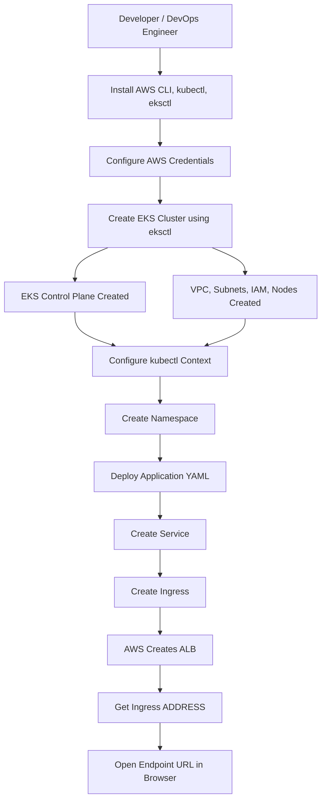
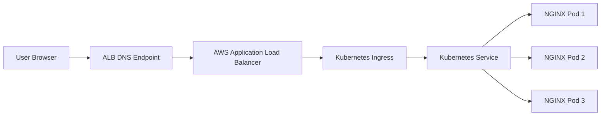
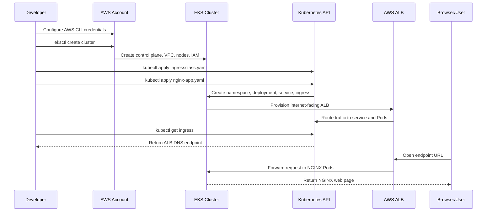

# Amazon EKS End-to-End Flow: Create Cluster, Deploy One Application, Access Endpoint URL

> **Goal:** Create an Amazon EKS cluster, deploy one web application, expose it publicly, and access it through an endpoint URL.
>
> **Recommended path in this guide:** `eksctl + Amazon EKS Auto Mode + Kubernetes Ingress + Application Load Balancer`.
>
> **Sample application:** NGINX web application running on port `80`.

---

## 1. What Is Amazon EKS?

Amazon EKS, Elastic Kubernetes Service, is AWS managed Kubernetes. AWS manages the Kubernetes control plane, while you deploy workloads as Kubernetes objects such as Pods, Deployments, Services, and Ingress.

In this setup:

- **EKS cluster** runs Kubernetes.
- **EKS Auto Mode** helps automate compute, networking, load balancing, and storage operations.
- **Pods** run your application containers.
- **Service** gives stable internal access to Pods.
- **Ingress** exposes the application externally through an AWS Application Load Balancer, ALB.
- **Endpoint URL** is the ALB DNS name created by AWS.

---

## 2. High-Level EKS Flow



---

## 3. Request Flow After Deployment



---

## 4. Prerequisites

You need the following before starting:

1. **AWS account** with permission to create EKS, EC2, IAM, VPC, CloudFormation, and Load Balancer resources.
2. **AWS CLI** installed and configured.
3. **kubectl** installed.
4. **eksctl** installed.
5. A terminal or AWS CloudShell.
6. AWS Region selected, for example:

```bash
export AWS_REGION=ap-south-1
```

> You can replace `ap-south-1` with your required AWS Region.

---

## 5. Configure AWS CLI

Run:

```bash
aws configure
```

Enter:

```text
AWS Access Key ID: <your-access-key>
AWS Secret Access Key: <your-secret-key>
Default region name: ap-south-1
Default output format: json
```

Verify your identity:

```bash
aws sts get-caller-identity
```

Expected output:

```json
{
  "UserId": "...",
  "Account": "123456789012",
  "Arn": "arn:aws:iam::123456789012:user/your-user"
}
```

---

## 6. Create EKS Cluster Using eksctl

Create a file named `cluster-config.yaml`:

```yaml
apiVersion: eksctl.io/v1alpha5
kind: ClusterConfig
metadata:
  name: demo-eks-cluster
  region: ap-south-1

autoModeConfig:
  enabled: true
```

Create the cluster:

```bash
eksctl create cluster -f cluster-config.yaml
```

This may take around 15 to 30 minutes.

When complete, verify the cluster:

```bash
kubectl get nodes
```

Expected output:

```text
NAME                              STATUS   ROLES    AGE   VERSION
ip-xxx-xxx-xxx-xxx.ec2.internal   Ready    <none>   10m   v1.xx.x-eks-xxxxxxx
```

Check all system Pods:

```bash
kubectl get pods -A
```

---

## 7. Configure kubectl Manually, If Needed

Normally `eksctl` updates your kubeconfig automatically. If required, run:

```bash
aws eks update-kubeconfig \
  --name demo-eks-cluster \
  --region ap-south-1
```

Validate:

```bash
kubectl config current-context
kubectl get svc
```

---

## 8. Create IngressClass for ALB

Create a file named `ingressclass.yaml`:

```yaml
apiVersion: networking.k8s.io/v1
kind: IngressClass
metadata:
  name: alb
  annotations:
    ingressclass.kubernetes.io/is-default-class: "true"
spec:
  controller: eks.amazonaws.com/alb
```

Apply it:

```bash
kubectl apply -f ingressclass.yaml
```

Verify:

```bash
kubectl get ingressclass
```

---

## 9. Deploy Single Application End-to-End

We will deploy one NGINX application with:

- Namespace
- Deployment
- Service
- Ingress

Create a file named `nginx-app.yaml`:

```yaml
apiVersion: v1
kind: Namespace
metadata:
  name: demo-app
---
apiVersion: apps/v1
kind: Deployment
metadata:
  name: nginx-deployment
  namespace: demo-app
spec:
  replicas: 3
  selector:
    matchLabels:
      app: nginx
  template:
    metadata:
      labels:
        app: nginx
    spec:
      containers:
        - name: nginx
          image: public.ecr.aws/nginx/nginx:1.25
          ports:
            - containerPort: 80
          resources:
            requests:
              cpu: "100m"
              memory: "128Mi"
            limits:
              cpu: "250m"
              memory: "256Mi"
---
apiVersion: v1
kind: Service
metadata:
  name: nginx-service
  namespace: demo-app
spec:
  selector:
    app: nginx
  ports:
    - protocol: TCP
      port: 80
      targetPort: 80
  type: ClusterIP
---
apiVersion: networking.k8s.io/v1
kind: Ingress
metadata:
  name: nginx-ingress
  namespace: demo-app
  annotations:
    alb.ingress.kubernetes.io/scheme: internet-facing
    alb.ingress.kubernetes.io/target-type: ip
spec:
  ingressClassName: alb
  rules:
    - http:
        paths:
          - path: /
            pathType: Prefix
            backend:
              service:
                name: nginx-service
                port:
                  number: 80
```

Apply the manifest:

```bash
kubectl apply -f nginx-app.yaml
```

---

## 10. Validate Application Resources

Check namespace:

```bash
kubectl get ns
```

Check Pods:

```bash
kubectl get pods -n demo-app -o wide
```

Expected:

```text
NAME                                READY   STATUS    RESTARTS   AGE
nginx-deployment-xxxxxxxxxx-abcde   1/1     Running   0          2m
nginx-deployment-xxxxxxxxxx-fghij   1/1     Running   0          2m
nginx-deployment-xxxxxxxxxx-klmno   1/1     Running   0          2m
```

Check Service:

```bash
kubectl get svc -n demo-app
```

Check Ingress:

```bash
kubectl get ingress -n demo-app
```

Expected output after a few minutes:

```text
NAME            CLASS   HOSTS   ADDRESS                                                                    PORTS   AGE
nginx-ingress   alb     *       k8s-demoapp-nginxingress-xxxxxxxxxx.ap-south-1.elb.amazonaws.com            80      3m
```

---

## 11. Access the Endpoint URL

Get only the endpoint URL:

```bash
kubectl get ingress nginx-ingress \
  -n demo-app \
  -o jsonpath='{.status.loadBalancer.ingress[0].hostname}'
```

Example output:

```text
k8s-demoapp-nginxingress-xxxxxxxxxx.ap-south-1.elb.amazonaws.com
```

Open in browser:

```text
http://k8s-demoapp-nginxingress-xxxxxxxxxx.ap-south-1.elb.amazonaws.com
```

You should see the NGINX welcome page.

You can also test from terminal:

```bash
curl http://$(kubectl get ingress nginx-ingress -n demo-app -o jsonpath='{.status.loadBalancer.ingress[0].hostname}')
```

---

## 12. Complete Application Deployment Flow



---

## 13. Useful kubectl Commands

### Cluster Health

```bash
kubectl cluster-info
kubectl get nodes -o wide
kubectl get pods -A
```

### Application Status

```bash
kubectl get all -n demo-app
kubectl describe pod -n demo-app <pod-name>
kubectl logs -n demo-app <pod-name>
```

### Ingress and Endpoint

```bash
kubectl get ingress -n demo-app
kubectl describe ingress nginx-ingress -n demo-app
```

### Restart Application

```bash
kubectl rollout restart deployment nginx-deployment -n demo-app
kubectl rollout status deployment nginx-deployment -n demo-app
```

### Scale Application

```bash
kubectl scale deployment nginx-deployment -n demo-app --replicas=5
kubectl get pods -n demo-app
```

---

## 14. Troubleshooting

### Issue 1: Nodes Not Ready

Check:

```bash
kubectl get nodes
kubectl describe node <node-name>
```

Possible reasons:

- IAM permission issue
- Node provisioning delay
- Subnet or networking issue
- Cluster creation still in progress

---

### Issue 2: Pods Pending

Check:

```bash
kubectl describe pod -n demo-app <pod-name>
```

Possible reasons:

- No available compute capacity
- Image architecture mismatch
- Resource limits too high
- Node selector or scheduling issue

---

### Issue 3: Ingress ADDRESS Empty

Check:

```bash
kubectl get ingress -n demo-app
kubectl describe ingress nginx-ingress -n demo-app
```

Wait 3 to 5 minutes. If still empty, check:

```bash
kubectl get ingressclass
kubectl describe ingressclass alb
```

Possible reasons:

- IngressClass missing
- Wrong controller name
- Subnet tagging issue
- Insufficient IAM permissions
- Load balancer provisioning delay

---

### Issue 4: Endpoint Not Opening

Check:

```bash
kubectl get ingress -n demo-app
kubectl get svc -n demo-app
kubectl get pods -n demo-app
```

Try:

```bash
curl -I http://<ALB-DNS-NAME>
```

Possible reasons:

- ALB still provisioning
- Pods not ready
- Security group or subnet issue
- Browser cache or DNS propagation delay

---

## 15. Cleanup to Avoid AWS Charges

Delete the application:

```bash
kubectl delete -f nginx-app.yaml
kubectl delete -f ingressclass.yaml
```

Delete the EKS cluster:

```bash
eksctl delete cluster \
  --name demo-eks-cluster \
  --region ap-south-1
```

Verify cluster deletion from AWS Console or with:

```bash
aws eks list-clusters --region ap-south-1
```

---

## 16. Files Created in This Guide

```text
cluster-config.yaml
ingressclass.yaml
nginx-app.yaml
```

Recommended folder structure:

```text
eks-demo/
├── cluster-config.yaml
├── ingressclass.yaml
└── nginx-app.yaml
```

---

## 17. Production Improvements

For production, consider adding:

- Custom VPC and private subnets
- HTTPS with ACM certificate
- Route 53 DNS record
- Horizontal Pod Autoscaler, HPA
- Observability using CloudWatch, Prometheus, and Grafana
- IAM Roles for Service Accounts or EKS Pod Identity
- Secrets management using AWS Secrets Manager
- CI/CD pipeline using GitHub Actions, AWS CodePipeline, or Azure DevOps
- Network policies
- Kubernetes resource requests and limits
- Pod disruption budgets
- Separate namespaces for dev, test, and prod

---

## 18. Optional HTTPS Ingress Example

If you have an ACM certificate ARN, you can add this annotation to the Ingress:

```yaml
alb.ingress.kubernetes.io/certificate-arn: arn:aws:acm:ap-south-1:123456789012:certificate/xxxxxxxx-xxxx-xxxx-xxxx-xxxxxxxxxxxx
alb.ingress.kubernetes.io/listen-ports: '[{"HTTP": 80}, {"HTTPS": 443}]'
alb.ingress.kubernetes.io/ssl-redirect: '443'
```

Then access:

```text
https://your-domain.example.com
```

For a friendly custom DNS name, create a Route 53 alias record pointing to the ALB.

---

## 19. Quick Command Summary

```bash
# 1. Set region
export AWS_REGION=ap-south-1

# 2. Create cluster
eksctl create cluster -f cluster-config.yaml

# 3. Verify cluster
kubectl get nodes
kubectl get pods -A

# 4. Create IngressClass
kubectl apply -f ingressclass.yaml

# 5. Deploy app
kubectl apply -f nginx-app.yaml

# 6. Verify app
kubectl get all -n demo-app
kubectl get ingress -n demo-app

# 7. Get endpoint URL
kubectl get ingress nginx-ingress -n demo-app -o jsonpath='{.status.loadBalancer.ingress[0].hostname}'

# 8. Test endpoint
curl http://$(kubectl get ingress nginx-ingress -n demo-app -o jsonpath='{.status.loadBalancer.ingress[0].hostname}')

# 9. Cleanup
kubectl delete -f nginx-app.yaml
kubectl delete -f ingressclass.yaml
eksctl delete cluster --name demo-eks-cluster --region ap-south-1
```

---

## 20. References

- AWS EKS getting started with `eksctl`: https://docs.aws.amazon.com/eks/latest/userguide/getting-started-eksctl.html
- AWS EKS general getting started guide: https://docs.aws.amazon.com/eks/latest/userguide/getting-started.html
- AWS EKS sample application deployment: https://docs.aws.amazon.com/eks/latest/userguide/sample-deployment.html
- AWS EKS Auto Mode web app quickstart: https://docs.aws.amazon.com/eks/latest/userguide/quickstart.html
- eksctl official website: https://eksctl.io/

