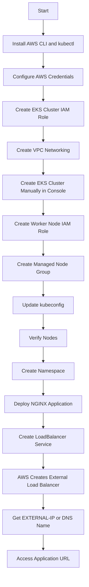
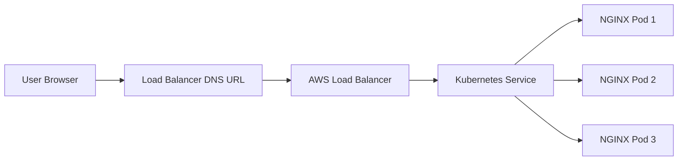
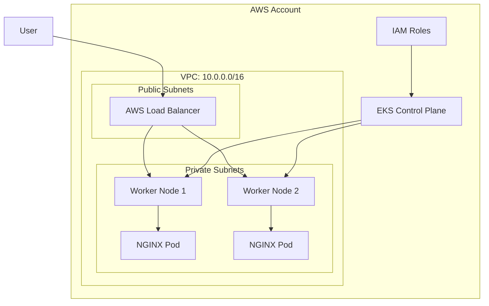
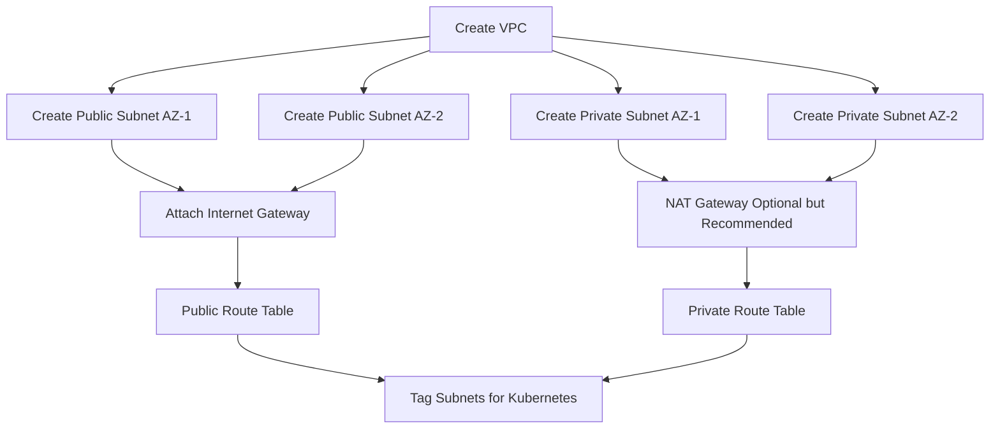
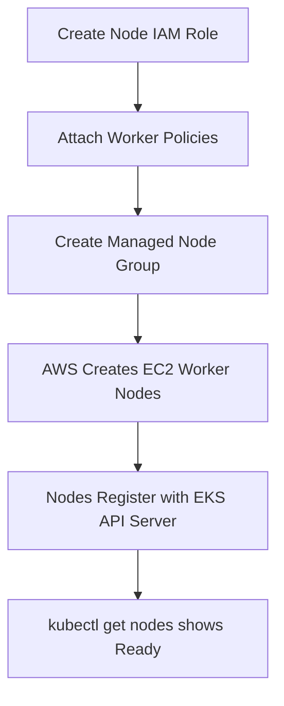
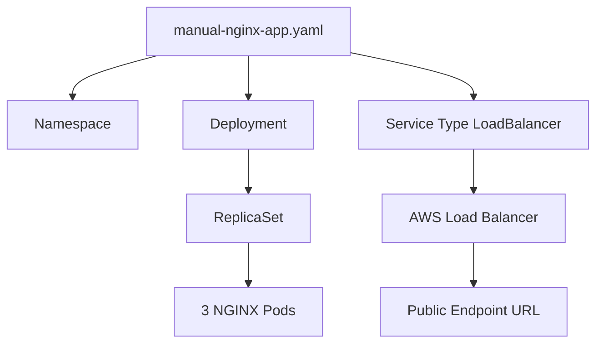
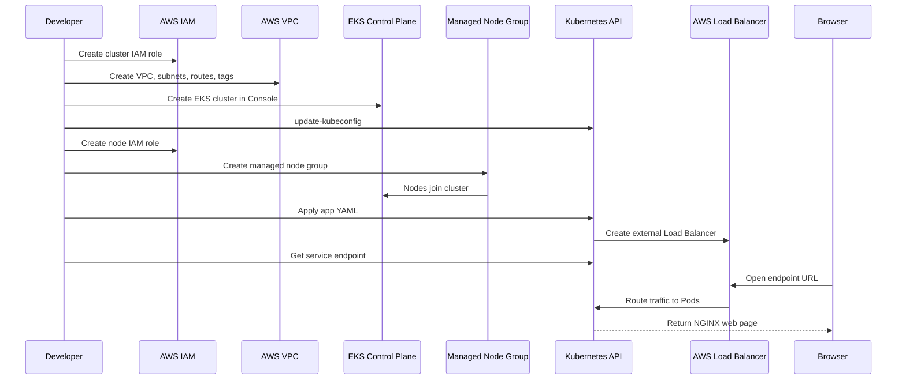
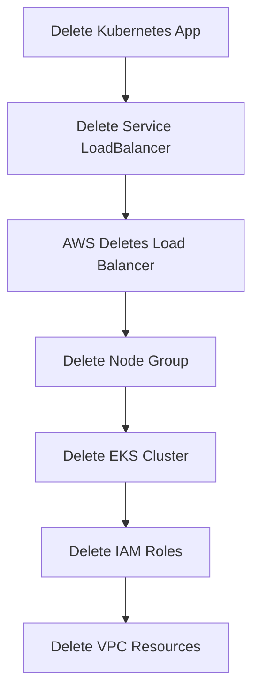
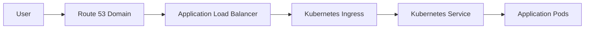

# Amazon EKS End-to-End Manual Setup Flow

> **Goal:** Create an Amazon EKS cluster manually, deploy one application, expose it publicly, and access the endpoint URL.
>
> **Manual approach in this guide:** AWS Management Console + AWS CLI + kubectl.
>
> **No eksctl used.** This is useful when you want to understand every AWS and Kubernetes component clearly.
>
> **Sample application:** NGINX web application running on port `80`.

---

## 1. What You Will Build

You will manually create the following:

1. IAM role for the EKS cluster control plane
2. VPC, public subnets, private subnets, route tables, and internet gateway
3. EKS cluster from AWS Console
4. IAM role for worker nodes
5. Managed Node Group
6. kubectl access to the cluster
7. Kubernetes namespace
8. Kubernetes Deployment
9. Kubernetes Service of type `LoadBalancer`
10. Public AWS Load Balancer endpoint URL
11. Cleanup steps to avoid AWS cost

---

## 2. Why Manual Setup?

Using `eksctl` is faster because it creates many resources automatically. Manual setup helps you understand:

- Why EKS needs IAM roles
- Why EKS needs VPC and subnets
- How Kubernetes worker nodes join the cluster
- How Pods are scheduled on nodes
- How Services expose applications
- How AWS Load Balancers connect public traffic to Kubernetes Pods

---

## 3. End-to-End Manual EKS Flow



---

## 4. Runtime Request Flow

After deployment, user traffic flows like this:



---

## 5. Architecture Overview



---

## 6. Prerequisites

You need:

- AWS account
- IAM user or role with permissions for EKS, EC2, IAM, VPC, CloudFormation, and Elastic Load Balancing
- AWS CLI v2
- kubectl
- Browser access to AWS Console
- Region selected, example: `ap-south-1`

Set your region:

```bash
export AWS_REGION=ap-south-1
export CLUSTER_NAME=manual-eks-cluster
```

Verify AWS identity:

```bash
aws sts get-caller-identity
```

Expected output:

```json
{
  "UserId": "EXAMPLEUSERID",
  "Account": "123456789012",
  "Arn": "arn:aws:iam::123456789012:user/example-user"
}
```

---

## 7. Manual Step 1: Create EKS Cluster IAM Role

The EKS control plane needs an IAM role so AWS can manage cluster-related resources.

### 7.1 Create Trust Policy

Create a file named `eks-cluster-trust-policy.json`:

```json
{
  "Version": "2012-10-17",
  "Statement": [
    {
      "Effect": "Allow",
      "Principal": {
        "Service": "eks.amazonaws.com"
      },
      "Action": "sts:AssumeRole"
    }
  ]
}
```

### 7.2 Create IAM Role

```bash
aws iam create-role \
  --role-name ManualEKSClusterRole \
  --assume-role-policy-document file://eks-cluster-trust-policy.json
```

### 7.3 Attach Required Policy

```bash
aws iam attach-role-policy \
  --role-name ManualEKSClusterRole \
  --policy-arn arn:aws:iam::aws:policy/AmazonEKSClusterPolicy
```

### 7.4 Get Role ARN

```bash
aws iam get-role \
  --role-name ManualEKSClusterRole \
  --query 'Role.Arn' \
  --output text
```

Save the output. Example:

```text
arn:aws:iam::123456789012:role/ManualEKSClusterRole
```

You will use this ARN while creating the EKS cluster.

---

## 8. Manual Step 2: Create VPC Networking

You can create the VPC manually from AWS Console or use AWS CloudFormation. For learning, understand the required components.

### 8.1 Required Networking Components

EKS needs:

- One VPC
- At least two subnets in different Availability Zones
- Public subnets for public load balancers
- Private subnets for worker nodes, recommended
- Internet Gateway for public subnet internet access
- NAT Gateway if private nodes need outbound internet access
- Route tables
- Security groups
- Correct Kubernetes subnet tags

---

## 9. Manual VPC Flow



---

## 10. VPC Option A: Create VPC from AWS Console

Go to:

```text
AWS Console -> VPC -> Create VPC
```

Choose:

```text
Resources to create: VPC and more
Name tag auto-generation: manual-eks
IPv4 CIDR block: 10.0.0.0/16
Number of Availability Zones: 2
Number of public subnets: 2
Number of private subnets: 2
NAT gateways: 1 per AZ, or 1 total for lower cost
VPC endpoints: None for basic setup
DNS hostnames: Enabled
DNS resolution: Enabled
```

Click:

```text
Create VPC
```

After creation, note:

- VPC ID
- Public subnet IDs
- Private subnet IDs

---

## 11. Required Subnet Tags

Add these tags to all EKS subnets:

```text
Key: kubernetes.io/cluster/manual-eks-cluster
Value: shared
```

For public subnets, add:

```text
Key: kubernetes.io/role/elb
Value: 1
```

For private subnets, add:

```text
Key: kubernetes.io/role/internal-elb
Value: 1
```

These tags help Kubernetes and AWS know where to create external or internal load balancers.

Example CLI tagging:

```bash
aws ec2 create-tags \
  --resources subnet-public-1 subnet-public-2 subnet-private-1 subnet-private-2 \
  --tags Key=kubernetes.io/cluster/manual-eks-cluster,Value=shared
```

Tag public subnets:

```bash
aws ec2 create-tags \
  --resources subnet-public-1 subnet-public-2 \
  --tags Key=kubernetes.io/role/elb,Value=1
```

Tag private subnets:

```bash
aws ec2 create-tags \
  --resources subnet-private-1 subnet-private-2 \
  --tags Key=kubernetes.io/role/internal-elb,Value=1
```

Replace subnet IDs with your actual subnet IDs.

---

## 12. Manual Step 3: Create EKS Cluster from AWS Console

Go to:

```text
AWS Console -> Elastic Kubernetes Service -> Clusters -> Create cluster
```

Choose:

```text
Cluster name: manual-eks-cluster
Kubernetes version: latest supported stable version
Cluster service role: ManualEKSClusterRole
```

Networking:

```text
VPC: Select your VPC
Subnets: Select at least two subnets in different Availability Zones
Cluster endpoint access: Public and private, or Public for learning
```

Logging, optional for learning:

```text
API server: Enabled
Audit: Enabled
Authenticator: Enabled
Controller manager: Enabled
Scheduler: Enabled
```

Add-ons:

Keep default add-ons:

```text
vpc-cni
kube-proxy
CoreDNS
```

Review and create the cluster.

Cluster creation may take 10 to 20 minutes.

---

## 13. Manual Step 4: Connect kubectl to EKS Cluster

After cluster status becomes `Active`, run:

```bash
aws eks update-kubeconfig \
  --region ap-south-1 \
  --name manual-eks-cluster
```

Verify context:

```bash
kubectl config current-context
```

Check cluster services:

```bash
kubectl get svc
```

Expected output:

```text
NAME         TYPE        CLUSTER-IP   EXTERNAL-IP   PORT(S)   AGE
kubernetes   ClusterIP   10.x.x.x     <none>        443/TCP   10m
```

At this point, the cluster exists, but there are no worker nodes yet.

---

## 14. Manual Step 5: Create Worker Node IAM Role

Worker nodes need an IAM role so EC2 instances can join the EKS cluster and pull container images.

### 14.1 Create Trust Policy

Create a file named `eks-node-trust-policy.json`:

```json
{
  "Version": "2012-10-17",
  "Statement": [
    {
      "Effect": "Allow",
      "Principal": {
        "Service": "ec2.amazonaws.com"
      },
      "Action": "sts:AssumeRole"
    }
  ]
}
```

### 14.2 Create Node IAM Role

```bash
aws iam create-role \
  --role-name ManualEKSNodeRole \
  --assume-role-policy-document file://eks-node-trust-policy.json
```

### 14.3 Attach Required Policies

```bash
aws iam attach-role-policy \
  --role-name ManualEKSNodeRole \
  --policy-arn arn:aws:iam::aws:policy/AmazonEKSWorkerNodePolicy

aws iam attach-role-policy \
  --role-name ManualEKSNodeRole \
  --policy-arn arn:aws:iam::aws:policy/AmazonEC2ContainerRegistryReadOnly

aws iam attach-role-policy \
  --role-name ManualEKSNodeRole \
  --policy-arn arn:aws:iam::aws:policy/AmazonEKS_CNI_Policy
```

### 14.4 Get Node Role ARN

```bash
aws iam get-role \
  --role-name ManualEKSNodeRole \
  --query 'Role.Arn' \
  --output text
```

Example:

```text
arn:aws:iam::123456789012:role/ManualEKSNodeRole
```

---

## 15. Manual Step 6: Create Managed Node Group

Go to:

```text
AWS Console -> EKS -> Clusters -> manual-eks-cluster -> Compute -> Add node group
```

Configure node group:

```text
Name: manual-ng-1
Node IAM role: ManualEKSNodeRole
```

Networking:

```text
Subnets: Select private subnets, recommended
```

Compute configuration:

```text
AMI type: Amazon Linux 2023 or Amazon Linux 2, based on available option
Instance type: t3.medium for learning
Disk size: 20 GiB
Desired size: 2
Minimum size: 1
Maximum size: 3
```

Review and create.

Wait until node group status becomes `Active`.

---

## 16. Node Group Flow



---

## 17. Verify Worker Nodes

Run:

```bash
kubectl get nodes -o wide
```

Expected output:

```text
NAME                              STATUS   ROLES    AGE   VERSION
ip-10-0-1-100.ec2.internal        Ready    <none>   5m    v1.xx.x-eks-xxxxxxx
ip-10-0-2-150.ec2.internal        Ready    <none>   5m    v1.xx.x-eks-xxxxxxx
```

Check system Pods:

```bash
kubectl get pods -A
```

You should see Pods like:

```text
kube-system   coredns-xxxxx       Running
kube-system   aws-node-xxxxx      Running
kube-system   kube-proxy-xxxxx    Running
```

---

## 18. Manual Step 7: Deploy One Application End-to-End

Now deploy the sample NGINX application.

Create a file named `manual-nginx-app.yaml`:

```yaml
apiVersion: v1
kind: Namespace
metadata:
  name: manual-demo-app
---
apiVersion: apps/v1
kind: Deployment
metadata:
  name: nginx-deployment
  namespace: manual-demo-app
spec:
  replicas: 3
  selector:
    matchLabels:
      app: nginx
  template:
    metadata:
      labels:
        app: nginx
    spec:
      containers:
        - name: nginx
          image: public.ecr.aws/nginx/nginx:1.25
          ports:
            - containerPort: 80
          resources:
            requests:
              cpu: "100m"
              memory: "128Mi"
            limits:
              cpu: "250m"
              memory: "256Mi"
---
apiVersion: v1
kind: Service
metadata:
  name: nginx-service
  namespace: manual-demo-app
  annotations:
    service.beta.kubernetes.io/aws-load-balancer-scheme: internet-facing
spec:
  type: LoadBalancer
  selector:
    app: nginx
  ports:
    - protocol: TCP
      port: 80
      targetPort: 80
```

Apply it:

```bash
kubectl apply -f manual-nginx-app.yaml
```

---

## 19. Application Object Flow



---

## 20. Validate Application Deployment

Check namespace:

```bash
kubectl get ns
```

Check Pods:

```bash
kubectl get pods -n manual-demo-app -o wide
```

Expected:

```text
NAME                                READY   STATUS    RESTARTS   AGE
nginx-deployment-xxxxxxxxxx-abcde   1/1     Running   0          2m
nginx-deployment-xxxxxxxxxx-fghij   1/1     Running   0          2m
nginx-deployment-xxxxxxxxxx-klmno   1/1     Running   0          2m
```

Check Deployment:

```bash
kubectl get deployment -n manual-demo-app
```

Check Service:

```bash
kubectl get svc -n manual-demo-app
```

Expected output after a few minutes:

```text
NAME            TYPE           CLUSTER-IP      EXTERNAL-IP                                                               PORT(S)        AGE
nginx-service   LoadBalancer   10.100.10.20    abc123xyz.ap-south-1.elb.amazonaws.com                                  80:31234/TCP   3m
```

---

## 21. Access Endpoint URL

Get endpoint URL:

```bash
kubectl get svc nginx-service \
  -n manual-demo-app \
  -o jsonpath='{.status.loadBalancer.ingress[0].hostname}'
```

Example output:

```text
abc123xyz.ap-south-1.elb.amazonaws.com
```

Open in browser:

```text
http://abc123xyz.ap-south-1.elb.amazonaws.com
```

You should see the NGINX welcome page.

Test using curl:

```bash
curl http://$(kubectl get svc nginx-service -n manual-demo-app -o jsonpath='{.status.loadBalancer.ingress[0].hostname}')
```

---

## 22. Complete Manual Deployment Sequence



---

## 23. Useful kubectl Commands

### Cluster Commands

```bash
kubectl cluster-info
kubectl get nodes -o wide
kubectl get pods -A
kubectl get svc -A
```

### Application Commands

```bash
kubectl get all -n manual-demo-app
kubectl get pods -n manual-demo-app -o wide
kubectl describe pod -n manual-demo-app <pod-name>
kubectl logs -n manual-demo-app <pod-name>
```

### Service and Endpoint Commands

```bash
kubectl get svc -n manual-demo-app
kubectl describe svc nginx-service -n manual-demo-app
kubectl get endpoints -n manual-demo-app
```

### Scaling Commands

```bash
kubectl scale deployment nginx-deployment \
  -n manual-demo-app \
  --replicas=5

kubectl get pods -n manual-demo-app
```

### Restart Application

```bash
kubectl rollout restart deployment nginx-deployment -n manual-demo-app
kubectl rollout status deployment nginx-deployment -n manual-demo-app
```

---

## 24. Troubleshooting

### 24.1 Cluster Stuck in Creating

Check:

```bash
aws eks describe-cluster \
  --name manual-eks-cluster \
  --region ap-south-1
```

Common reasons:

- Wrong IAM cluster role
- Missing IAM permissions
- Invalid VPC or subnet configuration
- Subnets not in multiple Availability Zones

---

### 24.2 kubectl Unauthorized Error

Command:

```bash
kubectl get nodes
```

Error example:

```text
error: You must be logged in to the server Unauthorized
```

Fix:

```bash
aws eks update-kubeconfig \
  --region ap-south-1 \
  --name manual-eks-cluster
```

Also ensure the same IAM user or role that created the cluster is being used.

---

### 24.3 Nodes Not Joining Cluster

Check node group in Console:

```text
EKS -> Clusters -> manual-eks-cluster -> Compute
```

Check from CLI:

```bash
aws eks describe-nodegroup \
  --cluster-name manual-eks-cluster \
  --nodegroup-name manual-ng-1 \
  --region ap-south-1
```

Common reasons:

- Node IAM role missing required policies
- Private subnet has no NAT Gateway for outbound internet access
- Security group issues
- Insufficient EC2 capacity
- Unsupported instance type in selected Availability Zone

---

### 24.4 Pods Pending

Run:

```bash
kubectl describe pod -n manual-demo-app <pod-name>
```

Common reasons:

- No ready worker nodes
- CPU or memory requests too high
- Image pull issue
- Node taints or scheduling restrictions

---

### 24.5 Service EXTERNAL-IP Pending

Run:

```bash
kubectl describe svc nginx-service -n manual-demo-app
```

Common reasons:

- Public subnet tags missing
- Load balancer permissions missing
- VPC or subnet route table issue
- AWS Load Balancer still provisioning

Verify subnet tags:

```bash
aws ec2 describe-subnets \
  --filters "Name=tag:kubernetes.io/cluster/manual-eks-cluster,Values=shared" \
  --query 'Subnets[*].{SubnetId:SubnetId,Tags:Tags}'
```

---

### 24.6 Endpoint URL Not Opening

Check:

```bash
kubectl get pods -n manual-demo-app
kubectl get svc -n manual-demo-app
kubectl describe svc nginx-service -n manual-demo-app
```

Test:

```bash
curl -I http://<LOAD-BALANCER-DNS-NAME>
```

Common reasons:

- Load balancer still initializing
- Pods not ready
- Wrong service selector
- Security group restriction
- DNS propagation delay

---

## 25. Manual Cleanup Flow



---

## 26. Cleanup Commands

### 26.1 Delete Application

```bash
kubectl delete -f manual-nginx-app.yaml
```

Wait until the Load Balancer is deleted:

```bash
kubectl get svc -n manual-demo-app
```

You can also check in AWS Console:

```text
EC2 -> Load Balancers
```

---

### 26.2 Delete Managed Node Group

From AWS Console:

```text
EKS -> Clusters -> manual-eks-cluster -> Compute -> manual-ng-1 -> Delete
```

Or CLI:

```bash
aws eks delete-nodegroup \
  --cluster-name manual-eks-cluster \
  --nodegroup-name manual-ng-1 \
  --region ap-south-1
```

Wait until deleted:

```bash
aws eks describe-nodegroup \
  --cluster-name manual-eks-cluster \
  --nodegroup-name manual-ng-1 \
  --region ap-south-1
```

---

### 26.3 Delete EKS Cluster

From AWS Console:

```text
EKS -> Clusters -> manual-eks-cluster -> Delete
```

Or CLI:

```bash
aws eks delete-cluster \
  --name manual-eks-cluster \
  --region ap-south-1
```

---

### 26.4 Delete IAM Role Policies and Roles

Detach cluster role policy:

```bash
aws iam detach-role-policy \
  --role-name ManualEKSClusterRole \
  --policy-arn arn:aws:iam::aws:policy/AmazonEKSClusterPolicy

aws iam delete-role \
  --role-name ManualEKSClusterRole
```

Detach node role policies:

```bash
aws iam detach-role-policy \
  --role-name ManualEKSNodeRole \
  --policy-arn arn:aws:iam::aws:policy/AmazonEKSWorkerNodePolicy

aws iam detach-role-policy \
  --role-name ManualEKSNodeRole \
  --policy-arn arn:aws:iam::aws:policy/AmazonEC2ContainerRegistryReadOnly

aws iam detach-role-policy \
  --role-name ManualEKSNodeRole \
  --policy-arn arn:aws:iam::aws:policy/AmazonEKS_CNI_Policy

aws iam delete-role \
  --role-name ManualEKSNodeRole
```

---

## 27. Manual Process Summary

```text
1. Configure AWS CLI
2. Create EKS cluster IAM role
3. Create VPC and subnets
4. Tag subnets correctly
5. Create EKS cluster from AWS Console
6. Update kubeconfig
7. Create node IAM role
8. Create managed node group
9. Verify nodes
10. Deploy NGINX app
11. Create LoadBalancer service
12. Get service endpoint DNS
13. Access app URL from browser
14. Cleanup resources
```

---

## 28. Folder Structure

```text
manual-eks-demo/
├── eks-cluster-trust-policy.json
├── eks-node-trust-policy.json
└── manual-nginx-app.yaml
```

---

## 29. Quick Command Summary

```bash
# Set variables
export AWS_REGION=ap-south-1
export CLUSTER_NAME=manual-eks-cluster

# Verify identity
aws sts get-caller-identity

# Update kubeconfig after cluster creation
aws eks update-kubeconfig --region ap-south-1 --name manual-eks-cluster

# Verify cluster
kubectl get nodes -o wide
kubectl get pods -A

# Deploy app
kubectl apply -f manual-nginx-app.yaml

# Check app
kubectl get all -n manual-demo-app

# Get endpoint
kubectl get svc nginx-service -n manual-demo-app -o jsonpath='{.status.loadBalancer.ingress[0].hostname}'

# Test endpoint
curl http://$(kubectl get svc nginx-service -n manual-demo-app -o jsonpath='{.status.loadBalancer.ingress[0].hostname}')

# Delete app
kubectl delete -f manual-nginx-app.yaml
```

---

## 30. Optional Next Level: Manual Ingress with ALB

The above setup uses a Kubernetes `Service` of type `LoadBalancer`, which is the simplest manual way to expose an endpoint.

For production web routing, you can also use:

- AWS Load Balancer Controller
- Kubernetes Ingress
- Application Load Balancer
- ACM SSL certificate
- Route 53 custom domain

Ingress flow:



Use this when you need:

- Host-based routing
- Path-based routing
- HTTPS termination
- Multiple applications behind one ALB
- Custom domain name

---

## 31. References

- AWS EKS Console and AWS CLI getting started guide: https://docs.aws.amazon.com/eks/latest/userguide/getting-started-console.html
- AWS EKS getting started overview: https://docs.aws.amazon.com/eks/latest/userguide/getting-started.html
- AWS EKS sample deployment guide: https://docs.aws.amazon.com/eks/latest/userguide/sample-deployment.html
- AWS EKS official getting started page: https://aws.amazon.com/eks/getting-started/
